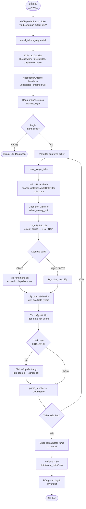
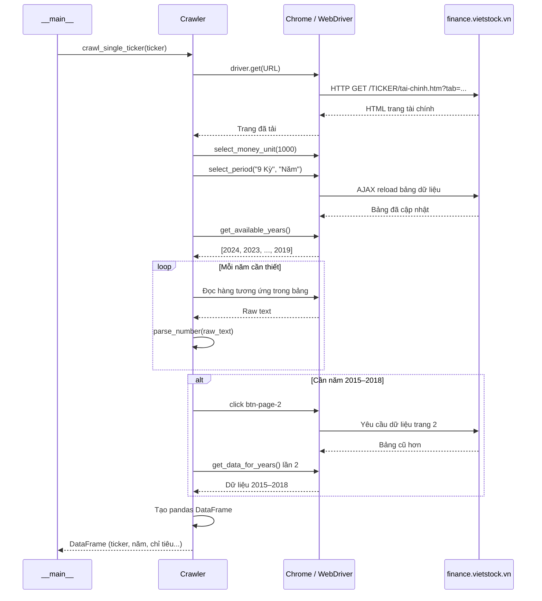
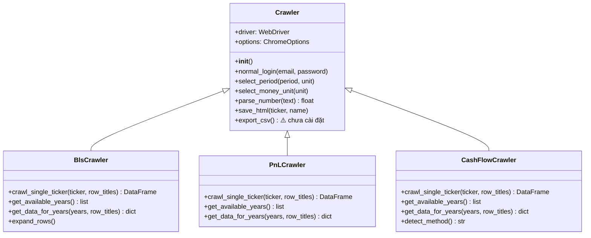

# Vietstock Crawler

Công cụ tự động thu thập dữ liệu báo cáo tài chính từ [finance.vietstock.vn](https://finance.vietstock.vn/) — hỗ trợ **Bảng cân đối kế toán (CDKT)**, **Kết quả kinh doanh (KQKD)** và **Lưu chuyển tiền tệ (LCTT)** cho ~240 mã chứng khoán, xuất kết quả ra file CSV.

---

## Mục lục

- [Tổng quan](#tổng-quan)
- [Cấu trúc dự án](#cấu-trúc-dự-án)
- [Sơ đồ hoạt động](#sơ-đồ-hoạt-động)
- [Công nghệ sử dụng](#công-nghệ-sử-dụng)
- [Cài đặt & Chạy](#cài-đặt--chạy)
- [Cấu hình](#cấu-hình)
- [Đầu ra](#đầu-ra)
- [Vấn đề / Lỗi cần giải quyết](#vấn-đề--lỗi-cần-giải-quyết)

---

## Tổng quan

| Thành phần | Mô tả |
|---|---|
| **Mục đích** | Thu thập dữ liệu báo cáo tài chính nhiều kỳ cho danh sách mã CK Việt Nam |
| **Nguồn dữ liệu** | `finance.vietstock.vn` (yêu cầu đăng nhập) |
| **Kỳ dữ liệu** | Năm tài chính, mặc định 9 kỳ (từ 2015 trở đi) |
| **Đơn vị tiền tệ** | ×1.000 VNĐ |
| **Lưu trữ** | CSV trên filesystem, không dùng database |
| **Chống bot** | `undetected_chromedriver` + Chrome headless |

---

## Cấu trúc dự án

```
vietstock-crawler/
│
├── crawl_viestock.py           # Base class Crawler (dùng chung)
├── balance_sheet_crawler.py    # Crawler bảng CĐKT
├── profit_n_lost_crawler.py    # Crawler kết quả KQKD
├── cash_flow_crawler.py        # Crawler lưu chuyển tiền tệ LCTT
│
├── .gitignore
└── README.md
```

**Kết quả sinh ra khi chạy (gitignored):**

```
data/
├── latest_data/                        # ← File CSV kết quả
├── html_logs/<ticker>/                 # ← Snapshot HTML để debug
└── screenshot_errors/<ticker>/         # ← Screenshot khi lỗi
```

**Quan hệ kế thừa:**

```
Crawler  (crawl_viestock.py)
├── BlsCrawler       (balance_sheet_crawler.py)
├── PnLCrawler       (profit_n_lost_crawler.py)
└── CashFlowCrawler  (cash_flow_crawler.py)
```

---

## Sơ đồ hoạt động

### Luồng tổng thể



---

### Luồng xử lý một ticker



---

### Cấu trúc class



---

## Công nghệ sử dụng

| Thành phần | Công nghệ |
|---|---|
| Ngôn ngữ | Python 3.10+ |
| Tự động hóa trình duyệt | Selenium WebDriver |
| Chống phát hiện bot | `undetected-chromedriver` |
| Xử lý dữ liệu | `pandas` |
| Trình duyệt | Google Chrome (cài đặt cục bộ) |
| Lưu trữ | CSV (filesystem) |

---

## Cài đặt & Chạy

### 1. Yêu cầu

- Python 3.10+
- Google Chrome đã cài đặt
- Tài khoản Vietstock Finance

### 2. Cài đặt thư viện

```bash
pip install undetected-chromedriver selenium pandas
```

> **Lưu ý:** Chưa có file `requirements.txt`. Xem [vấn đề #1](#vấn-đề--lỗi-cần-giải-quyết).

### 3. Cấu hình thông tin đăng nhập

Mở file crawler tương ứng, tìm đến hàm `crawl_tickers_sequential` và điền thông tin:

```python
crawler.normal_login(email='your@email.com', password='your_password')
```

> **Lưu ý:** Thông tin đăng nhập hiện bị hardcode. Xem [vấn đề #2](#vấn-đề--lỗi-cần-giải-quyết).

### 4. Chạy crawler

```bash
# Thu thập bảng cân đối kế toán (CDKT)
python balance_sheet_crawler.py

# Thu thập kết quả kinh doanh (KQKD)
python profit_n_lost_crawler.py

# Thu thập lưu chuyển tiền tệ (LCTT)
python cash_flow_crawler.py
```

Kết quả CSV được lưu tại `data/latest_data/`.

---

## Cấu hình

Tất cả cấu hình hiện tại đều **hardcode trong source code** (chưa có file config):

| Tham số | Vị trí | Mặc định |
|---|---|---|
| Danh sách ticker | `__main__` mỗi file | ~240 mã |
| Kỳ báo cáo | `select_period()` | 9 kỳ / Năm |
| Đơn vị tiền tệ | `select_money_unit()` | ×1.000 VNĐ |
| Năm cần lấy | `get_data_for_years()` | 2015 – năm hiện tại |
| Đường dẫn output | `output_csv` trong `__main__` | `data/latest_data/` |
| Thông tin đăng nhập | `normal_login()` | *(trống — phải điền)* |

---

## Đầu ra

### File CSV

| Script | File output | Encoding |
|---|---|---|
| `balance_sheet_crawler.py` | `240_TSCD_VH_4.csv` | `utf-8-sig` |
| `profit_n_lost_crawler.py` | `240_KQKD_4.csv` | `utf-8-sig` |
| `cash_flow_crawler.py` | `240_KH_TSCD_4.csv` | *(mặc định)* |

**Cấu trúc cột CSV:**

```
ticker | Year | <chỉ tiêu 1> | <chỉ tiêu 2> | ...
```

### Debug & Lỗi

| Thư mục | Nội dung |
|---|---|
| `data/html_logs/<ticker>/` | Snapshot HTML của trang tại thời điểm crawl |
| `data/screenshot_errors/<ticker>/` | Ảnh chụp màn hình khi xảy ra lỗi |

---

## Vấn đề / Lỗi cần giải quyết

### Nghiêm trọng

- [ ] **#1 — Thiếu `requirements.txt`:** Không có file khai báo dependency, phiên bản thư viện không được kiểm soát. Cần tạo `requirements.txt` hoặc `pyproject.toml`.

- [ ] **#2 — Credentials hardcode:** Email/password đăng nhập Vietstock hiện để trống trong source, phải chỉnh tay trước mỗi lần chạy. Cần dùng biến môi trường (`.env` + `python-dotenv`) hoặc tham số CLI.

- [ ] **#3 — Typo tên file:** `crawl_viestock.py` thiếu chữ `t` (đúng phải là `crawl_vietstock.py`). Ảnh hưởng tới import statement nếu mở rộng dự án.

### Tính năng chưa hoàn chỉnh

- [ ] **#4 — `export_csv()` chưa được cài đặt:** Method trong base class `Crawler` chỉ có `pass`, không có logic. Cần implement hoặc xóa bỏ.

- [ ] **#5 — `ThreadPoolExecutor` import nhưng không dùng:** `concurrent.futures` được import trong một số file nhưng toàn bộ crawl chạy tuần tự. Cần implement crawl song song để tăng tốc độ, hoặc xóa import thừa.

- [ ] **#6 — Google Login bị lỗi XPath:** Hàm Google OAuth dùng `container(@href, ...)` — không phải XPath hợp lệ, phải là `contains(@href, ...)`. Chức năng đăng nhập bằng Google hiện không hoạt động.

### Chất lượng code & kiến trúc

- [ ] **#7 — Không có file cấu hình:** Tất cả tham số (danh sách ticker, năm, kỳ, đường dẫn output) đều hardcode. Cần tách ra file `config.yaml` hoặc `.env`.

- [ ] **#8 — Danh sách ticker hardcode ~240 mã:** Cần đọc từ file CSV/JSON bên ngoài để dễ bảo trì và cập nhật.

- [ ] **#9 — Cash flow thiếu hỗ trợ phương pháp trực tiếp:** `CashFlowCrawler` hiện chỉ xử lý phương pháp gián tiếp (indirect). Phương pháp trực tiếp bị skip, chưa hoàn thiện.

- [ ] **#10 — Encoding không nhất quán:** `balance_sheet_crawler.py` và `profit_n_lost_crawler.py` dùng `utf-8-sig`, còn `cash_flow_crawler.py` dùng encoding mặc định. Cần chuẩn hóa về `utf-8-sig`.

- [ ] **#11 — Không có xử lý retry:** Khi mạng chập chờn hoặc Vietstock timeout, crawler không có cơ chế retry. Cần thêm decorator `@retry` hoặc vòng lặp với backoff.

- [ ] **#12 — Không có logging chuẩn:** Hiện dùng `print()` để log. Cần thay bằng module `logging` với level (INFO/WARNING/ERROR) và ghi ra file.

- [ ] **#13 — Thiếu unit test:** Không có bất kỳ test nào. Cần tối thiểu test `parse_number()` và mock Selenium để kiểm tra logic crawl.

### Cải tiến dài hạn

- [ ] **#14 — Thêm CLI với `argparse`:** Cho phép truyền ticker, kỳ, đơn vị, output path từ dòng lệnh thay vì sửa source code.

- [ ] **#15 — Hỗ trợ lưu vào database:** Thêm tùy chọn xuất sang SQLite hoặc PostgreSQL thay vì chỉ CSV.

- [ ] **#16 — Docker hóa:** Đóng gói Chrome + Python + deps vào Docker image để chạy trên mọi môi trường mà không cần cài thủ công.

- [ ] **#17 — CI/CD pipeline:** Thêm GitHub Actions để chạy crawl tự động theo lịch (sau mùa công bố BCTC).

---

> **Ghi chú:** Dự án hiện ở trạng thái prototype. Commit đầu tiên ghi chú: *"ver1, just upload to save code. Need refactor in future"*.
